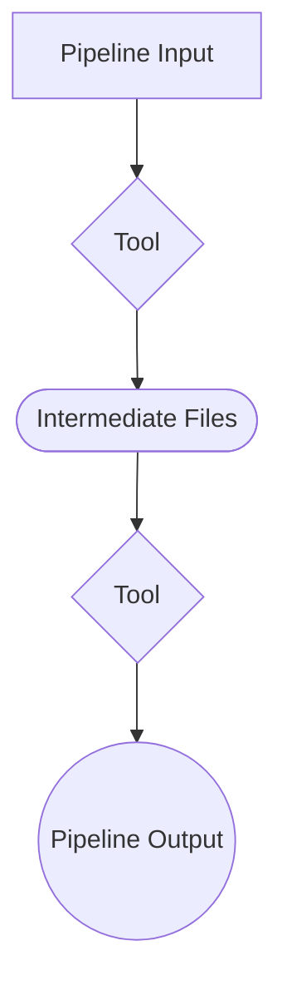

<!-- omit in toc -->
# [REPOSITORY NAME] - USER GUIDE

> ℹ️ *Feel free to adjust this template to suit your needs, while ensuring that all information necessary for reproducibility is included. See instructions (👉 in italics) and example content provided under each section header below.*

---

<!-- omit in toc -->
## Table of Contents

> 👉 *OPTIONAL: The Table of Contents (TOC) may be omitted if the overall content is brief. The TOC can be easily autogenerated, for example, by running command [Create Table of Contents](https://marketplace.visualstudio.com/items?itemName=yzhang.markdown-all-in-one#table-of-contents) in the VSCode extension `Markdown All in One`. To exclude a heading from appearing in the autogenerated TOC, add `<!-- omit in toc -->` at the end of that heading or just above it. The TOC will be auto-updated whenever the file is saved after heading changes.*

- [Overview](#overview)
  - [Workflow diagram](#workflow-diagram)
- [Data](#data)
- [Installation](#installation)
  - [Pre-requisites](#pre-requisites)
  - [Setup Instructions](#setup-instructions)
- [Parameters](#parameters)
- [Usage](#usage)
- [Output](#output)

---

## Overview

> 👉 *Provide a high-level process summary with an optional workflow diagram, created using [Mermaid Diagramming and charting tool](https://mermaid.js.org/) and its [test playground](https://www.mermaidchart.com/play).*

This project implements a generic pipeline for data ingestion, processing, and analysis. It can be customized to suit different types of workflows.

### Workflow diagram



---

## Data

> 👉 *Provide information on input data formats, structure, and sources.*

- **Dataset 1**: FASTQ reads retrieved from NCBI on 2025-01-01.
- **Dataset 2**: Reference genome in FASTA format from Ensembl, downloaded on 2025-01-01.

To download the data, run: `curl -O https://example.com/path/to/dataset1.tar.gz`

---

## Installation

> 👉 *Provide pre-requisites and setup instructions.*

### Pre-requisites

- Conda
- Python 3.9+
- Recommended OS: Linux

### Setup Instructions

- Clone the repository:

```bash
git clone https://github.com/your-org/your-repo.git
cd your-repo
```

- Create the Conda environment

```bash
conda env create -f your-repo/config/environment.yml
```

## Parameters

> 👉 *List all configuration options in a clear and consistent format. Include descriptions, expected values, and defaults if applicable.*  

| Parameter          | Description                                         | Type    | Default    | Example                 |
|--------------------|-----------------------------------------------------|---------|------------|-------------------------|
| `--input_folder`   | Path to the folder containing input data.           | Path    | `data`     | `./data/fastq`          |
| `--output_folder`  | Path to the folder where results will be written.   | Path    | `results`  | `./results/experiment1` |
| `--enable_logging` | Enable logging of execution steps (`true/false`).   | Boolean | `true`     | `false`                 |

Notes:

- All paths can be relative or absolute.
- If not specified, default values will be used.  

---

## Usage

> 👉 *If applicable, provide details of parameters or a table of configuration options and their descriptions.*

To execute the pipeline, activate the conda environment and run:

```bash
conda activate <conda_env_name>
python script.py --input_folder data/fastq --output_folder results/experiment1
```

Notes:

- Ensure adequate disk space for temporary and output files.

---

## Output

> 👉 *Describe output format, location, naming convention, and purpose.*

Output files include:

- `results/experiment1/reports/summary.csv`: Key analysis metrics.
- `results/experiment1/plots/visualization.png`: Generated plot.
- `results/experiment1/logs/pipeline.log`: Execution log.

---
